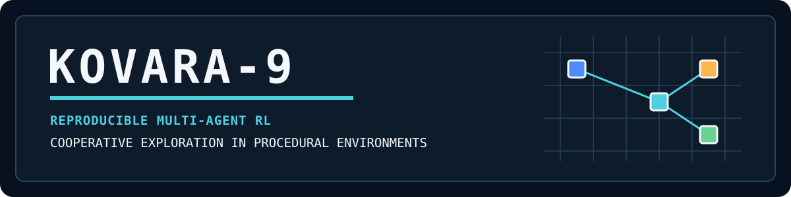
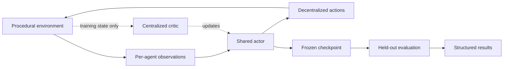
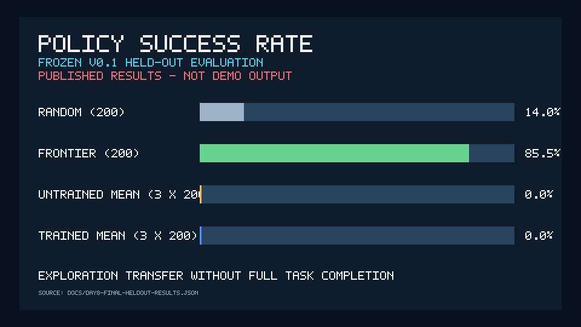
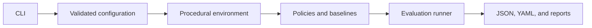

# KOVARA-9

[](https://github.com/hiteshkumarTech/KOVARA-9/actions/workflows/ci.yml)
[](pyproject.toml)
[](https://github.com/hiteshkumarTech/KOVARA-9/releases/tag/v0.1.0)
[](LICENSE)

**Reproducible multi-agent reinforcement learning for cooperative exploration in procedural environments.**

A reproducible multi-agent reinforcement-learning research platform that demonstrated partial
exploration transfer but failed to learn full cooperative task completion under the tested
configuration. KOVARA-9 pairs a procedural PettingZoo simulator with MAPPO-style training,
deterministic evaluation, classical baselines, and structured research artifacts.

> **Key result — exploration transfer without full task completion.** The trained policies improved exploration and partial target recovery over their exact untrained initializations, but achieved zero full-task successes on the held-out evaluation and remained below random and frontier baselines.

Run the public walkthrough:

```console
kovara9 demo
```

It executes real simulator transitions with safe development seeds, compares random and handcrafted
frontier behavior, and performs no training or final evaluation. **The demo is a behavioral
walkthrough, not a benchmark or a trained-policy result.**

## Quick start

KOVARA-9 supports **Python `>=3.12,<3.13`**. Python 3.13 is intentionally outside the validated
range.

### Windows PowerShell

```powershell
git clone https://github.com/hiteshkumarTech/KOVARA-9.git
cd KOVARA-9
uv venv --python 3.12
.\.venv\Scripts\Activate.ps1
uv pip install -e .
kovara9 demo
```

If activation is blocked by local PowerShell policy, keep the policy unchanged and run
`.\.venv\Scripts\kovara9.exe demo` directly.

### macOS and Linux

```bash
git clone https://github.com/hiteshkumarTech/KOVARA-9.git
cd KOVARA-9
uv venv --python 3.12
source .venv/bin/activate
uv pip install -e .
kovara9 demo
```

For a locked contributor environment with test and documentation tools, use `uv sync --locked`
and then `uv run kovara9 demo`. See [troubleshooting](docs/troubleshooting.md) if `pip` is absent,
the command is not found, or an output directory already exists.

## What the demo shows


*A real 10-frame frontier episode from development seed 4243. It recovers 2/2 targets in 9 steps;
this single safe-seed example is not a performance estimate. Regenerate it with
`python scripts/generate_readme_assets.py`.*

The packaged workflow runs two bounded examples:

| Example | Policy | Seed | Purpose |
|---|---|---:|---|
| `random-example` | Seeded random baseline | 4242 | Show an uncoordinated reference behavior |
| `handcrafted-frontier-example` | Handcrafted frontier heuristic | 4243 | Show structured local exploration |

Both seeds are in the configured training/development partition `[0, 10,000)` and outside the
locked final-test partition `[20,000, 21,000)`. The command writes validated YAML and JSON evidence
to a new output directory and refuses to overwrite an existing path.

Useful variants:

```console
kovara9 demo --no-render
kovara9 demo --validate-only
kovara9 demo --output-dir path/to/new-directory
```

The static [demo frame](docs/assets/demo-frame.png), animation, comparison chart, and social preview
are generated by [one deterministic script](scripts/generate_readme_assets.py). Their hashes and
source provenance are recorded in the [asset manifest](docs/assets/readme-assets-manifest.json).

## Research question

Can independently acting agents learn coordination on procedurally generated training environments
and retain useful behavior on unseen procedural environments?

The environment exposes each policy only to that agent's local observation. Simulator state is used
for transitions, metrics, debugging, and the centralized critic during MAPPO training—not for
decentralized action selection.



## What the experiment found



*Derived from the frozen [Day 8 final-result JSON](docs/day8-final-heldout-results.json). This is a
visualization of published evaluation data, not demo output.*

The final evaluation used frozen actors from three training seeds. Each learned or exact-untrained
actor was evaluated on the same 200 held-out episodes (100 reference and 100 structural-transfer
episodes). Classical baselines used the same 200 episode set.

| Policy | Episodes | Successes | Success rate | Mean targets recovered | Mean completion progress | Mean exploration coverage |
|---|---:|---:|---:|---:|---:|---:|
| Random | 200 | 28 | 0.140 | 3.1800 | 0.6383 | 0.9043 |
| Frontier heuristic | 200 | 171 | 0.855 | 4.7200 | 0.9479 | 0.9036 |
| Exact untrained actors, mean | 600 | 0 | 0.000 | 0.1283 | 0.0267 | 0.3991 |
| Frozen trained actors, mean | 600 | 0 | 0.000 | 0.6133 | 0.1269 | 0.5016 |

<!-- day8-metric:trained_success_rate=0.0 -->
<!-- day8-metric:random_success_rate=0.14 -->
<!-- day8-metric:frontier_success_rate=0.855 -->
<!-- day8-metric:trained_targets_recovered=0.6133333333333334 -->
<!-- day8-metric:trained_completion_progress=0.12694444444444444 -->
<!-- day8-metric:trained_exploration_coverage=0.5016276777306968 -->

In normal language:

- Training changed behavior: learned actors explored more and recovered more targets than their
  exact untrained initializations.
- That transfer was incomplete: all three frozen trained actors recorded zero full successes.
- The handcrafted frontier baseline remained substantially stronger on the evaluated task.
- This negative result is useful because the hypothesis and seed partitions were preregistered,
  checkpoints were frozen before final testing, and there was no post-test tuning.

Read the [research summary](docs/research-summary.md), [final result record](docs/day8-final-heldout-results.md),
[model card](MODEL_CARD.md), and [limitations](docs/v0.1-limitations-and-future-work.md) for the exact
protocol and threats to validity.

## Main capabilities

| Area | What is implemented |
|---|---|
| Simulator | Parallel PettingZoo grid-rescue environment with deterministic procedural generation |
| Policies | Seeded random, handcrafted frontier, and shared-actor MAPPO-style CTDE |
| Training | Shared actor, centralized critic, synchronous rollout, checkpointing, and resume support |
| Evaluation | Predeclared seed partitions, paired comparisons, bootstrap intervals, and structured artifacts |
| Reproducibility | Validated YAML configuration, derived seed streams, environment fingerprints, and final-test lock |
| Developer experience | Cross-platform CLI demo, strict typing, tests, packaging, and CI on Windows and Ubuntu |

KOVARA-9 is a research platform—not a production deployment system—and currently focuses on one
cooperative procedural task and one main multi-agent learning algorithm.

## Architecture



The simulator, renderer, policies, and experiment orchestration are separate subsystems. Policies
depend on declared observation/action interfaces rather than concrete environment internals. The
[architecture guide](docs/architecture.md) contains the training flow, package boundaries, and an
adapter concept for reuse from another simulation.

## Research methodology

- **Procedural split:** training, validation, and final-test seeds occupy disjoint declared ranges.
- **Controlled evaluation:** random, frontier, untrained, and frozen trained policies see paired
  held-out episode seeds.
- **Frozen decision:** the Day 6 preregistration fixes the final question and procedure before Day 8.
- **Reproducible randomness:** stochastic behavior flows through explicit seed derivation; no
  module-global random generator is used.
- **Auditable outputs:** runs write configuration fingerprints, environment provenance, metrics,
  checkpoints, and integrity records.

Start with the [methodology](docs/experiment_methodology.md) and
[reproducibility guide](docs/reproducibility.md).

## Honest limitations

- Frozen trained policies achieved no full held-out task successes.
- There is no bundled trained checkpoint; the public demo uses only classical baselines.
- The current evidence comes from one procedural environment family and three training seeds.
- A frontier heuristic outperformed both random and learned policies on full completion.
- The animation is one illustrative seed, not an aggregate estimate.
- KOVARA-9 has not been validated as a production system or as a general MARL benchmark suite.

These constraints are part of the result, not details to hide. See the
[full limitations record](docs/v0.1-limitations-and-future-work.md).

## Reproducibility

The published v0.1.0 evidence is frozen. Its exact result JSON, figure manifest, checkpoint hashes,
test-partition consumption record, and release integrity report remain in the repository.

```powershell
uv sync --locked
uv run ruff format --check src tests scripts
uv run ruff check src tests scripts
uv run mypy src
uv run pytest
```

Do not rerun or tune against the consumed final-test partition. Use the declared training and
validation ranges for new development and create a new preregistered protocol for future scientific
claims. The [reproducibility guide](docs/reproducibility.md) explains fingerprints, checkpoints,
seed policy, and artifact verification.

## Using KOVARA-9

The CLI exposes training, evaluation, inspection, and demo workflows:

```console
kovara9 --help
kovara9 train --help
kovara9 evaluate --help
kovara9 inspect --help
kovara9 demo --help
```

Configuration examples live under [configs](configs). Public workflows validate configuration before
execution and surface invalid states with context.

## Extending the framework

New environments should preserve simulator/rendering separation and connect through adapters at the
observation/action boundary. Algorithms should depend on policy protocols rather than importing a
concrete environment. A proposed external integration remains an adapter concept until it is tested;
no third-party simulator is claimed as integrated.

See [using KOVARA-9 in other projects](docs/using-kovara9-in-other-projects.md),
[architecture](docs/architecture.md), and [contributing](CONTRIBUTING.md).

## Project structure

```text
src/kovara9/       package, simulator, policies, training, evaluation, and CLI
configs/           validated research and evaluation configurations
tests/             unit, property, integration, smoke, and release-integrity tests
scripts/           reproducible experiment, validation, and documentation tooling
docs/              architecture, methodology, audit trail, results, and guides
.github/            CI and contribution templates
```

## Documentation

Use the [documentation index](docs/README.md) as the map of record. High-value entry points:

- [Open-source demo](docs/open-source-demo.md)
- [Architecture](docs/architecture.md)
- [Research methodology](docs/experiment_methodology.md)
- [Final evaluation](docs/day8-final-heldout-results.md)
- [Reproducibility](docs/reproducibility.md)
- [Troubleshooting](docs/troubleshooting.md)
- [Roadmap](docs/roadmap.md)
- [Decision log](docs/decisions.md)

## Contributing

Bug reports, reproducibility questions, bounded feature proposals, and environment-adapter designs are
welcome. Read [CONTRIBUTING.md](CONTRIBUTING.md), the [code of conduct](CODE_OF_CONDUCT.md), and the
[support guide](.github/SUPPORT.md) before opening an issue or pull request. Scientific claims require
traceable evidence; generated metrics or unavailable checkpoints must never be presented as real.

## Citation

If you use KOVARA-9, cite the software metadata in [CITATION.cff](CITATION.cff). GitHub's
**Cite this repository** control can export that record.

```text
Kumar, Hitesh, and KOVARA-9 Contributors. KOVARA-9 (version 0.1.0), 2026.
https://github.com/hiteshkumarTech/KOVARA-9
```

## License and security

KOVARA-9 is available under the [Apache License 2.0](LICENSE). Report vulnerabilities through the
[security policy](SECURITY.md); do not include secrets or sensitive data in a public issue.
