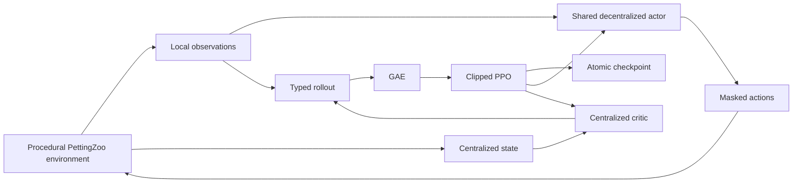
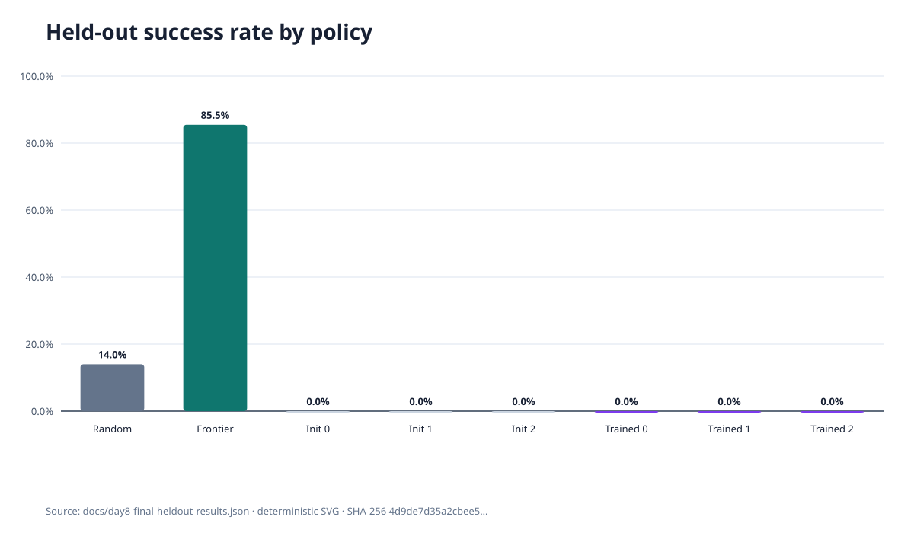
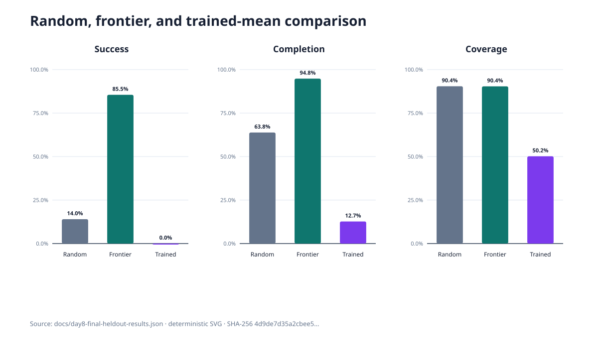

# KOVARA-9

A reproducible multi-agent reinforcement-learning research platform for cooperative exploration and
generalization in unseen procedural environments.

> **Final v0.1 result — exploration transfer without task completion.**

A reproducible multi-agent reinforcement-learning research platform that demonstrated partial exploration transfer but failed to learn full cooperative task completion under the tested configuration.

**The trained policies improved exploration and partial target recovery over their exact untrained
initializations, but achieved zero full-task successes on the held-out evaluation and remained below
random and frontier baselines.** The frontier baseline is a handcrafted heuristic, not a learned
model. KOVARA-9 is a research simulator, not an autonomous rescue system.

## Research question

Can independently executing agents learn useful coordination from local observations and limited
communication, then retain that behavior on unseen procedural seeds and a structurally different
environment?

The v0.1 experiment tests that question with centralized training and decentralized execution
(CTDE), exact untrained controls, random and frontier baselines, three training seeds, validation-only
candidate selection, and one preregistered held-out evaluation.

## What KOVARA-9 actually does

- Implements a deterministic, procedural cooperative grid environment through the PettingZoo
  Parallel API.
- Gives each actor only its agent-local observation, personal communication state, and action masks.
- Trains one parameter-shared PyTorch actor with a separate centralized critic using a MAPPO-style
  clipped PPO and GAE pipeline.
- Derives every stochastic stream from explicit semantic seeds.
- Saves atomic checkpoints containing actor, critic, optimizer, collector, progress, and RNG state,
  with exact rollout-boundary resume.
- Evaluates random, handcrafted frontier, exact initialization, and frozen trained policies on
  aligned episode seeds.
- Fingerprints configurations, checkpoints, preregistration, and reports, then locks a consumed
  final-test partition against tuning reuse.
- Preserves negative results instead of converting a partial-behavior signal into a completion claim.

### What this repository demonstrates

The implementation provides concrete portfolio evidence for multi-agent environment design,
procedural generation, partial observability, CTDE, parameter sharing, PPO, GAE, action masking,
deterministic seed management, checkpointing and exact resume, scientific evaluation, paired
baseline comparison, preregistration, negative-result reporting, test engineering, packaging, and
continuous-integration configuration. See the suggested [repository metadata](docs/portfolio-metadata.md).

## Five-minute quick start

Prerequisites: Python 3.12, [uv](https://docs.astral.sh/uv/), and PowerShell 5.1 or newer for the
guided demo. CUDA and private credentials are not required.

```powershell
git clone <repository-url>
Set-Location KOVARA-9
uv sync --locked
powershell -NoProfile -ExecutionPolicy Bypass -File scripts/run_recruiter_demo.ps1
```

The demo validates configuration, renders fixed-seed random and frontier episodes, runs an untrained
rollout smoke, regenerates figures from the committed Day 8 JSON, verifies the frozen candidate and
consumption lock, and displays the recorded quality summary. It never runs the final evaluation.
Trained checkpoints are intentionally uncommitted; an optional trusted local checkpoint can be
supplied with `-CheckpointPath`.

For a platform-neutral first look:

```console
uv sync --locked
uv run kovara9 config validate configs/environments/grid_rescue_easy.yaml
uv run kovara9 env run --config configs/environments/grid_rescue_easy.yaml --agent frontier --seed 4243 --render ansi
uv run python scripts/generate_result_figures.py
```

Detailed narration: [five-minute recruiter demo](docs/recruiter-demo.md).

## Architecture



The actor boundary is deliberately narrower than the critic boundary: actors never consume the
global map or teammate-global state. Simulator transitions remain independent from rendering,
metrics, and training. See the four detailed [architecture and lifecycle diagrams](docs/architecture.md).

## Learning approach

The v0.1 learner is a synchronous MAPPO-style simplification:

- one feed-forward actor shared across homogeneous agents;
- one feed-forward centralized team-value critic;
- separate movement and message logits with exact action masks;
- factored joint log probability and entropy;
- boundary-aware GAE with correct termination and truncation bootstrap;
- clipped PPO, advantage normalization, Adam, and joint gradient clipping;
- deterministic masked-argmax evaluation from local observations only.

It has no recurrent memory, curriculum, distributed collection, value clipping, target-KL stopping,
or multiple competing learning algorithms. Those omissions matter when interpreting the result.

## Experimental protocol

| Stage | Evidence | Decision |
|---|---|---|
| Day 5 | One short seed improved coverage but not success or recovery | No qualifying task improvement |
| Day 6 | Three seeds, 16,384 transitions each; success remained zero | Exploration-only validation improvement |
| Day 7 | One controlled target-reward increase regressed partial metrics | Reject shaping; retain unchanged Day 6 candidate |
| Day 8 | One preregistered test on 100 unseen seeds and two structures | Exploration transfer without task completion |

Training seeds were `0, 1, 2`; candidate selection used validation seeds `10000–10019`; the final
test used the separately declared and now-consumed partition. Every final policy received aligned
seeds and both environments exactly once, subject to one documented technical continuation before
the missing eighth policy produced a usable artifact. The complete methodology is
[documented here](docs/experiment_methodology.md).

## Final results

The table pools 100 procedural-seed episodes and 100 structurally held-out episodes per policy.

| Policy group | Episodes | Successes | Success rate | Mean targets | Mean completion | Mean coverage |
|---|---:|---:|---:|---:|---:|---:|
| Random | 200 | 28 | 0.140 | 3.180 | 0.6383 | 0.9043 |
| Frontier heuristic | 200 | 171 | 0.855 | 4.720 | 0.9479 | 0.9036 |
| Exact untrained actors, mean | 600 | 0 | 0.000 | 0.1283 | 0.0267 | 0.3991 |
| Frozen trained actors, mean | 600 | 0 | 0.000 | 0.6133 | 0.1269 | 0.5016 |





All values and additional per-seed comparisons are in the [final held-out report](docs/day8-final-heldout-results.md)
and its [machine-readable JSON](docs/day8-final-heldout-results.json). The figures are deterministic
views of that JSON; they do not read raw runs or execute evaluation.

## What worked

- Every trained seed improved targets recovered, normalized completion progress, efficiency, and
  coverage over its exact initialization.
- Partial improvements appeared on both the familiar structure with unseen procedural seeds and the
  held-out larger structure.
- Training, checkpoint/resume, evaluation alignment, parameter immutability, and consumption-lock
  integrity checks passed.
- The frontier baseline demonstrated that the environment and action interface support strong task
  completion when supplied with handcrafted structure.
- The complete negative experimental history remains inspectable from Day 5 through Day 8.

## What did not work

- No trained actor completed a single held-out episode.
- Training never improved the primary metric over exact initialization.
- Random behavior outperformed the learned actors on central task metrics.
- The handcrafted frontier heuristic substantially outperformed every learned policy.
- Large blocked-movement counts and weak discovery-to-recovery conversion remained.
- Three training seeds and one final partition do not support statistical-significance or broad-
  generalization claims.

## Reproducibility

Reproducibility is implemented as a chain rather than a single seed flag:

```text
validated configuration → canonical fingerprint → semantic seed streams → atomic checkpoint
→ validation-only freeze → fingerprinted preregistration → test-consumption lock → final report
```

Runs record resolved inputs, package/platform versions, Git state, seeds, fingerprints, metrics, and
checksums. Exact resume restores model, optimizer, collector, counters, histories, and explicit RNG
states at rollout boundaries. See [the reproducibility guide](docs/reproducibility.md) for smoke,
short-training, full Day 6, Windows temporary-directory, build, and final-results-inspection paths.
The independent release-preparation evidence is in the [Day 10 final audit](docs/day10-final-audit.md).

## Installation

```console
uv sync --locked
uv run kovara9 --help
```

The supported interpreter range is Python `>=3.12,<3.13`. CPU is the reference execution path.
CUDA may be selected by compatible local configurations, but cross-device bitwise equivalence is not
claimed. Do not install or run untrusted checkpoints; PyTorch checkpoint loading should be treated as
code-adjacent input.

## CLI commands

| Command | Purpose |
|---|---|
| `kovara9 config validate` | Validate environment, evaluation, or training YAML |
| `kovara9 config verify-candidate` | Recompute the frozen candidate and bound fingerprints |
| `kovara9 env run` | Run one rendered or headless baseline episode |
| `kovara9 rollout-smoke` | Collect a short untrained rollout without optimization |
| `kovara9 update-smoke` | Prove one finite optimizer update; not a benchmark |
| `kovara9 train` | Run configured training or exact initialization/resume workflows |
| `kovara9 day6-run-seed` | Run one controlled Day 6 training seed on validation inputs |
| `kovara9 evaluate` | Evaluate random or frontier on a non-consumed suite |
| `kovara9 evaluate-checkpoint` | Evaluate a trusted local actor checkpoint deterministically |
| `kovara9 compare-policies` | Produce aligned baseline/initial/trained comparisons |
| `kovara9 final-evaluate` | Irreversible preregistered workflow; the v0.1 partition is consumed |

The consumed-test guard rejects ordinary evaluation or tuning commands that select the final
partition. No bypass command is documented.

## Repository structure

```text
configs/           validated environment, evaluation, reward, and training protocols
docs/              architecture, methodology, daily records, cards, and reproducibility guides
docs/assets/       Mermaid sources and deterministic SVG result figures
scripts/           figure generation and the PowerShell recruiter demo
src/kovara9/       simulator, policies, learner, evaluator, reporting, and CLI
tests/             unit, property-oriented, integration, reproducibility, and integrity tests
```

Checkpoints, raw runs, caches, coverage files, virtual environments, and build outputs are ignored
and must not be committed.

## Tests and quality

```powershell
$testRoot = Join-Path $env:TEMP ("kovara9-pytest-" + [DateTime]::UtcNow.ToString("yyyyMMddHHmmss"))
uv run ruff format --check .
uv run ruff check .
uv run mypy
uv run pytest --basetemp $testRoot
```

The suite covers simulator invariants, procedural reproducibility, actor/critic boundaries, GAE,
PPO math, checkpoint/resume equivalence, CLI workflows, final-evaluation integrity, documentation
links, figure provenance, demo safety, citation metadata, and forbidden-artifact hygiene. CI runs
the same formatting, linting, typing, testing, and packaging gates.

## Limitations

KOVARA-9 v0.1 is a small 2D simulator with feed-forward actors, sparse rewards, limited training
exposure, three training seeds, two held-out structures, deterministic argmax evaluation, and no
real-world sensors or actuators. It is unsuitable for operational rescue, safety-critical decisions,
human interaction, or claims about physical robots. See the [model/system card](MODEL_CARD.md) and
[v0.1 limitations and future work](docs/v0.1-limitations-and-future-work.md).

## Roadmap

The Day 10 audit and release preparation are documented; the repository owner must still confirm
CI, rename the GitHub repository, merge the reviewed pull request, tag the merged `main` commit, and
publish the release. Longer-term research candidates—requiring separate controlled experiments and
new untouched test data—include improved credit assignment, curricula, memory, and coordination
mechanisms. None is assumed to solve the task. See the [roadmap](docs/roadmap.md) and
[release checklist](docs/release-checklist.md).

## Citation

Citation metadata is provided in [`CITATION.cff`](CITATION.cff). No paper, DOI, or peer-reviewed
publication is claimed.

```text
KOVARA-9 Contributors. KOVARA-9: a reproducible multi-agent reinforcement-learning research
platform, version 0.1.0 (software).
```

## License

Licensed under the [Apache License 2.0](LICENSE).
