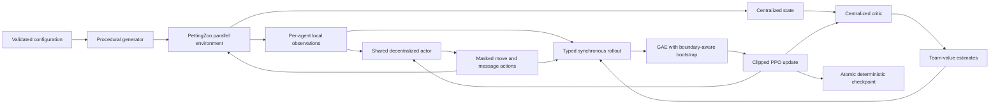
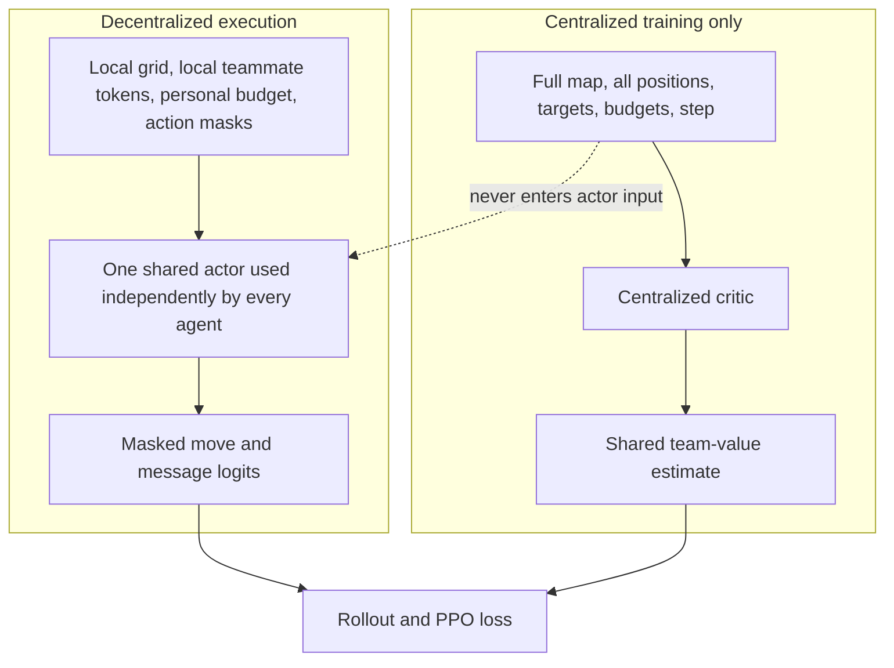

# System architecture

## Visual overview

The diagrams below are documentation views of the implemented subsystem boundaries. Their Mermaid
sources live under [`docs/assets/`](assets/) so reviewers can inspect or reuse them without a binary
diagram tool.

### System architecture

### Information boundary

### Experiment lifecycle

```mermaid
flowchart LR
    P0[Phase 0 simulator and baselines] --> HARDEN[API and reproducibility hardening]
    HARDEN --> OPT[PPO and GAE pipeline]
    OPT --> DET[Deterministic checkpoint and resume]
    DET --> DAY5[Day 5 short training]
    DAY5 --> DAY6[Day 6 three-seed validation]
    DAY6 --> DAY7[Day 7 reward experiment]
    DAY7 --> FREEZE[Frozen Day 6 candidate]
    FREEZE --> PREREG[Day 8 preregistration]
    PREREG --> TEST[One held-out evaluation]
    TEST --> RESULT[Exploration transfer without task completion]
```

### Reproducibility chain

```mermaid
flowchart LR
    CONFIG[Validated YAML] --> FP[Configuration fingerprint]
    FP --> SEEDS[Semantic seed streams]
    SEEDS --> RUN[Typed run records]
    RUN --> CKPT[Checkpoint and checksum]
    CKPT --> FREEZE[Frozen candidate]
    FREEZE --> PREREG[Fingerprint-locked preregistration]
    PREREG --> LOCK[Test-consumption lock]
    LOCK --> REPORT[Final report]
    REPORT --> FIGURES[JSON-derived figures]
```

## Boundaries

Configuration is validated before constructing a simulator. The procedural generator produces an
immutable initial world state from an explicit RNG. `GridRescueParallelEnv` owns transition rules
and exposes decentralized PettingZoo observations plus a separate centralized `state()` view.

Policies implement an environment-independent protocol. Renderers consume immutable snapshots and
cannot advance the simulator. Evaluation orchestrates policies and environments, metrics consume
recorded events, and reporting persists typed records.

The packaged open-source demo composes those same boundaries rather than introducing a second
simulator path. A strictly validated `DemoConfig` supplies the environment, baseline policy names,
explicit seeds, seed partitions, and frame limit. Evaluation may publish defensive snapshots to an
optional observer after reset and after each transition. The demo's ANSI adapter renders those
copies after simulation; the observer cannot issue actions, access mutable environment state, or
change metrics. Demo reports are derived from the same factual `EpisodeRecord` used by evaluation.

Each decentralized observation contains the local grid, teammate token slots, the agent's remaining
communication budget, and fixed-shape `move_action_mask` and `message_action_mask` arrays. Action
spaces never change during an episode. A non-silent token selected after the budget reaches zero is
converted to a rejected no-op: it is not broadcast, charged, or counted, and the agent receives
`communication_rejected: true` in its personal transition info.

## CTDE boundary

Future trainers may consume centralized state during optimization. Executing policies receive only
their local observation and personal memory. This separation is enforced by distinct interfaces
instead of a runtime flag inside a shared observation object.

The centralized `state()` view contains the full obstacle/target/recovery map, ordered agent-position
channels, active-agent slots, ordered communication budgets, ordered latest-message tokens, and the
step counter. It is never passed to baseline policies. Policy outcome info is restricted to personal
movement blocking, personal accepted-message status, and personal communication rejection. Team
recoveries, accepted-message totals, success, and other evaluator facts are available through the
immutable environment-level `last_events` record and snapshots instead of policy info.

## v0.1 learner boundary

The v0.1 learner uses one `SharedActor` instance for every homogeneous agent and a separate
`CentralizedCritic`. `ActorObservationEncoder` accepts only values contained by the decentralized
observation space and produces an `ActorInput`; `CentralStateEncoder` accepts `state_space` values and
produces a distinct `CriticInput`. Both the type boundary and runtime validation reject crossing
these inputs.

Networks are feed-forward MLP foundations with independently derived initialization seeds. The actor
has separate movement and message logits. A factored distribution layer applies the two masks before
normalization and never constructs a Cartesian action space. Invalid actions have exactly zero
probability; a mask row with no legal action is an error. Stochastic selection uses an explicit
device-local Torch generator, while evaluation uses a deterministic masked argmax. Joint log
probability and entropy are the sums of their inspectable movement and communication factors.

`SynchronousRolloutCollector` owns a configured set of in-process environments behind a declared
protocol; it does not use workers or import transition rules. At each tick it batches decentralized
observations in environment-major, stable agent order for the shared actor and independently batches
`state()` values for the critic. Environment info is consumed only after selection to record the
personal communication-rejection event; team-global outcome fields cannot enter the actor path.

Fixed-shape rollout storage records local actor features, centralized critic features, both masks,
factored actions and log probabilities, shared rewards, values, per-transition next values,
live-agent slots, communication rejections, episode-start and end boundaries, environment IDs,
transition IDs, and the fixed agent order. Terminal centralized state is evaluated before a reset;
true terminations then receive a zero bootstrap, while truncations retain that terminal-state value.
This prevents the next episode's initial value from leaking across a boundary.

GAE retains explicit time, environment, and agent axes. It uses centralized values without adding
centralized features to actor samples, stops its recurrence at termination, truncation, reset, and
inactive-agent boundaries, and excludes padded slots. True terminations have no bootstrap;
time-limit truncations use the terminal-state value captured by the collector. Returns are formed
from unnormalized advantages so optional normalization changes only the actor signal.

The optimizer flattens only after GAE has separated trajectories, repeats each environment's
centralized critic feature for its active homogeneous agent samples, and keeps local actor features
in a separate typed field. It evaluates the stored factored action through the current shared actor,
combines movement and message log probabilities into the PPO ratio, and evaluates the centralized
critic independently. One Adam optimizer owns disjoint actor and critic parameters. Each epoch uses
an explicit optimizer-shuffle generator, permits a smaller final minibatch, clips the joint gradient
norm, and rejects non-finite inputs, ratios, losses, gradients, or parameters.

`MAPPOTrainer` owns the rollout/GAE/update schedule. Scheduled validation wraps the shared actor in
the same environment-independent `Policy` protocol used by baselines. The wrapper encodes one local
observation, applies its two masks, and selects deterministic modes; its API has no critic or
central-state input. Saved-policy and untrained-neural comparison workflows reuse this adapter.

Checkpoints are published only at complete rollout/update boundaries. They contain strict model
states, Adam slots, progress counters, metric history, the policy-sampling and optimizer-shuffle
generator states, and the collector's in-progress environment states. The environment exports and
restores validated transition data through the collector protocol; training code does not mutate
grid-rescue internals or replay actions. Resume validates training, environment, and validation
fingerprints plus observation/state/action dimensions and stable agent order before restoring any
state. Checkpoint evaluation validates only the decentralized observation/action signature, which
allows compatible held-out environments without exposing centralized state to the actor.

Training artifacts use a collision-safe run directory. Resolved configuration and provenance are
written before optimization; metrics, checkpoints, and the manifest are individually replaced
atomically, with the manifest referencing a checkpoint only after that checkpoint is complete.

This remains a feed-forward, shared-team-value, synchronous MAPPO-style simplification. There is no
recurrent policy, value clipping, target-KL early stopping, or distributed collector. The smoke
configuration proves pipeline and resume correctness only; it is not evidence of learned behavior.

## Extension points

- New environments implement the same parallel environment and snapshot boundaries.
- New policies implement `Policy`; they do not import grid-rescue internals.
- Future trainers implement `Trainer` and own algorithm-specific dependencies.
- A future 3D viewer implements `Renderer` or consumes recorded snapshots without modifying
  simulator dynamics.
