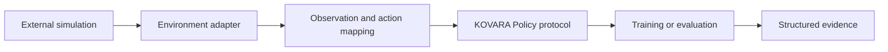

# Using KOVARA-9 in other projects

KOVARA-9 can be reused as research infrastructure when an external simulator can preserve the same
information and reproducibility boundaries. This page describes an integration concept; it does not
claim that any named third-party environment is already supported.

## Intended boundary

The adapter owns translation between the external simulation and KOVARA-9 types. An algorithm or
policy should not import concrete simulation internals.

## Required properties

An integration should provide:

- deterministic reset and transition behavior under explicit seed streams;
- stable agent identifiers and declared observation/action spaces;
- local observations that contain no hidden centralized state;
- a separate centralized state view only if a CTDE trainer needs it;
- immutable snapshots or event records for metrics and optional rendering;
- explicit termination and truncation semantics;
- validated configuration for research parameters; and
- tests for action validity, seed repeatability, boundary behavior, and public workflows.

The renderer must remain downstream of simulator snapshots. It may display or export state, but it
must not advance the simulation or choose actions.

## Policy interface

Baselines and learned-policy adapters implement the environment-independent `Policy` protocol in
`src/kovara9/agents/policy.py`. Each independently acting policy receives only its own observation,
action space, and personal transition outcome. Team-global facts belong in environment records and
metrics, not policy inputs.

## Evaluation integration

Reuse the evaluation runner only after the adapter's reset, step, observation, and snapshot behavior
is covered by tests. Declare development, validation, and final-test seed partitions before making a
scientific comparison. New final claims require a new preregistration and must not reuse the consumed
v0.1.0 final-test decision.

## Proposal checklist

Before implementing an adapter, open an environment proposal and document:

1. the research question it enables;
2. observation and action mappings;
3. the decentralized/centralized information boundary;
4. deterministic seed ownership;
5. termination, truncation, and metric semantics;
6. required dependencies and licensing; and
7. unit, property, integration, and reproducibility tests.

See [architecture](architecture.md), [methodology](experiment_methodology.md), and
[contributing](../CONTRIBUTING.md) for the constraints behind this boundary.
